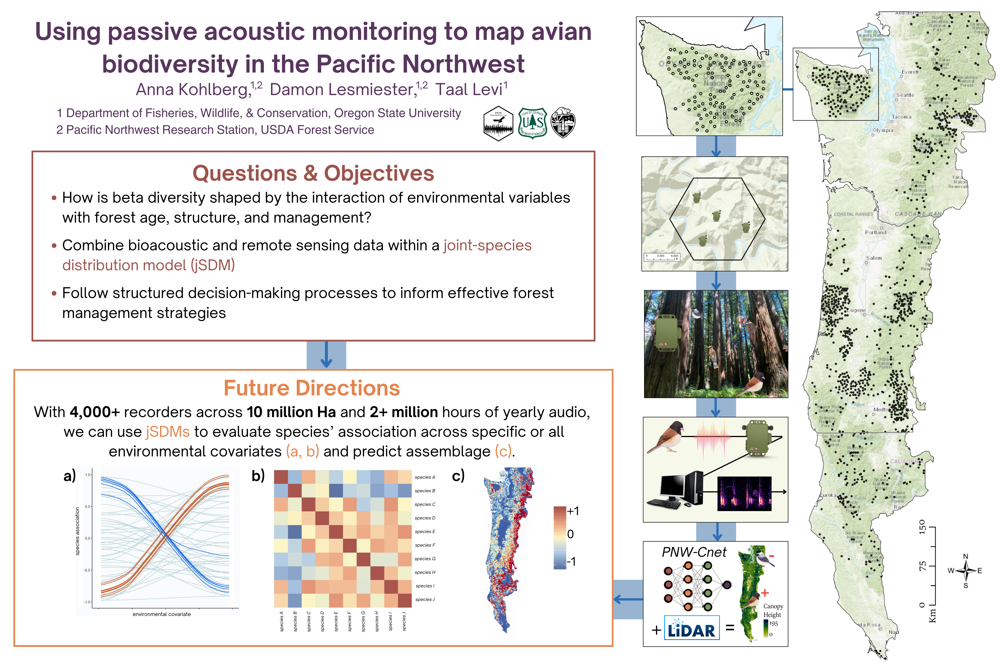

# Using Passive Acoustic Monitoring to Map Biodiversity in the Pacific Northwest

## abstract
The rapid harvest of old forest and  consequent decline of the old-growth obligate Northern Spotted Owl prompted the establishment of the Northwest Forest Plan in 1994, designed to retain biodiverse forests while maintaining timber production. However, evaluating the effectiveness of the plan through quantifiable biodiversity assessments is challenging at broad spatial and temporal scales. The Pacific Northwest Bioacoustics Lab at the USDA Forest Service has recently established one of the largest bioacoustics networks on earth, with over 4,000 sites surveyed each year and spanning approximately 10 million ha of federally administered land in California, Oregon, and Washington. Using advanced machine learning modeling to automate species identification, we streamline the millions of hours of recordings thereby translating audio input into ecologically meaningful data across space and time. Here, I integrate passive acoustic monitoring and remote sensing within joint species distribution models to quantify how environmental variables and forest management influence the assemblage of vocal vertebrate species. I expect to observe niche partitioning and complex interactions among co-occurring species, lending to observable differences in spatial distribution and community dynamics.

This study will offer valuable insights into the effectiveness of different forest management strategies in maintaining or enhancing vertebrate biodiversity. Decisions made about land use and forest management are highly linked to the livelihoods of both human and ecological communities. I will follow a structured decision-making process to incorporate the values of multiple stakeholders, including state and federal agencies, landowners, tribal organizations, and the timber-dependent communities within the study area.

## graphical abstract

## repo organization
there are four folders available that contain **data**, **code**, **figures** and other relavant material for this project

- the [data](data) folder holds the necessary data needed to run analyses

- the [code](code) folder contains x, y, z which pertain to x, y, and z things

- the [figures](figures) folder has the chapter's figures and scripts used to generate them

- the [manuscript](manuscript) folder has a copy of the working manuscript for this thesis chapter 

## reproducibility
to reproduce the code provided in this repo, data must be configured to a 'wide' format and following the *meta guidelines* provided in the code folder. 

## joint species distribution model (jSDM)
i will be performing a [jSDM in R](https://cran.r-project.org/web/packages/jSDM/vignettes/jSDM.html) using the binomial probit in the long format, where

**ecological process:**

$$ y_{ij} = Bernoulli(\theta_{ij})$$